由于 .NET 7 之后，官方也做了 Prometheus、Metrics 收集，因此使用官方的库来实现：

https://learn.microsoft.com/zh-cn/dotnet/core/diagnostics/metrics-collection


### 简介

CZGL.SystemInfo 是一个支持 Windows 和 Linux 等平台的能够获取机器硬件信息、采集机器资源信息、监控进程资源的库。

在不引入额外依赖的情况下，使用 .NET Runtime 本身的 API，或通过计算获得信息，提供高性能的计算方式以及缓存，提高性能，还提供 dotnet tool 工具，通过命令行在终端使用。 


Windows 可以使用 System.Diagnostics.PerformanceCounter 、System.Management.ManagementObjectSearcher 分别获得性能计算器以及机器的 CPU型号、磁盘序列化号等信息。

平台差异而且很难统一，所以如获取某些硬件的型号序列化，获得进程信息的资源信息，这些需求调用系统相关的API或者使用命令行操作，需要自己定制。


在新版本中，增加了跨平台获取 CPU、内存、网络、磁盘的功能。

这个库并不是多完善的库，只是封装了一些 API，加上了一些计算方法。

**如果需要使用，建议复制代码到项目中，然后根据需求进行修改**。


### 预览

CZGL.ProcessMetrics 是一个 Metrics 库，能够将程序的 GC、CPU、内存、机器网络、磁盘空间等信息记录下来，使用 Prometheus 采集信息，然后使用 Grafana 显示。支持 .NET Core 和 .NET Framework 应用，例如 Wpf、Winfrom 应用等。


视频地址：

[https://www.bilibili.com/video/BV18y4y1K7Ax/](https://www.bilibili.com/video/BV18y4y1K7Ax/)

教程地址：[https://github.com/whuanle/CZGL.SystemInfo/blob/primary/docs/Metrics.md](https://github.com/whuanle/CZGL.SystemInfo/blob/primary/docs/Metrics.md)

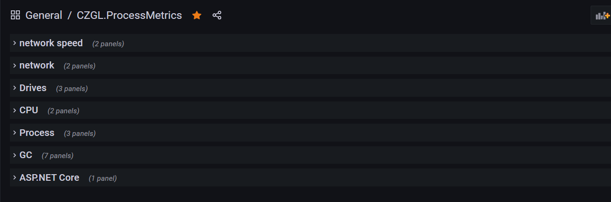

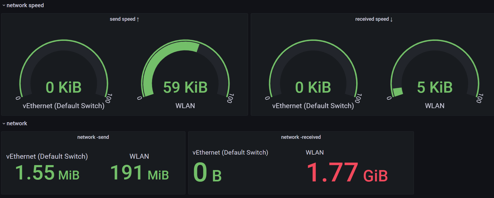


### 使用在线监控

可通过 Prometheus 采集程序信息，接着使用 Grafana 分析、显示数据。

CZGL.ProcessMetrics 支持 .NET Standard 2.0 和 .NET Core 3.1，但是在 .NET Standard 2.0 中，因为缺少部分 Core API，所以有部分信息是无法获取的，这部分信息如下：

| 标识                         | .NET Core API               | 说明             |
| ---------------------------- | --------------------------- | ---------------- |
| gc_memory_info               | GC.GetGCMemoryInfo()        | 获取 GC 内存信息 |
| total_allocated_bytes        | GC.GetTotalAllocatedBytes() | 总分配量         |
| dotnet_lock_contention_total | Monitor.LockContentionCount | 线程池竞争数量   |


CZGL.ProcessMetrics 支持 .NET Framework 、.NET Core。


#### 使用方法

有两种方式使用 Metrics，第一种是使用内置的 HttpListener，不需要放到 Web 中即可独立提供 URL 访问，适合 winform、wpf 或纯 控制台等应用。但是使用 HttpListener，需要使用管理员方式启动应用才能正常运行。

使用方法：

```csharp
using CZGL.ProcessMetrics;
... ...
MetricsServer metricsServer = new MetricsServer("http://*:1234/metrics/");
metricsServer.Start();
```


另外一种是使用 ASP.NET Core，Metrics 作为中间件加入到 Web 应用中，此时使用的是 kestrel 。

在 Nuget 中，搜索 `CZGL.ProcessMetrics.ASPNETCore` 包，然后使用中间件生成 Metrics 端点。

```csharp
            app.UseEndpoints(endpoints =>
            {
                endpoints.MapControllers();
                endpoints.ProcessMetrices("/metrics");
            });
```


但是目前无论哪种，都必须让暴露端口出去，让 Prometheus 能够访问到 API。后期会增加支持不需要暴露 API 、提供 Web 服务，即可直接推送监控信息到 Prometheus 的功能。


访问 `/metrics` 可以查看到记录的信息。

打开 Prometheus 的 prometheus.yml 文件，在最后加上：

```yaml
  - job_name: 'processmetrice'
    metrics_path: '/metrics'
    static_configs:
    - targets: ['106.12.123.123:1234']
```

> 请修改上面的 IP。


然后重启 Prometheus ，打开 Prometheus 的 Status-Targets，即可看到已被加入监控。


按照 [https://prometheus.io/docs/visualization/grafana/](https://prometheus.io/docs/visualization/grafana/) 配置好 Prometheus 。


然后下载  [CZGL.ProcessMetrics.json](docs/CZGL.ProcessMetrics.json)  文件，在 Grafana 中导入。


#### 自定义监控指标

你也可以自定义要监控的指标数据。

如果要单独输出 Prometheus 监控数据，你需要引用一个 prometheus.net 包。

但是在 CZGL.ProcessMetrics 中，编写了一个简单的生成器，而无需引用 prometheus.net 包。

你可以通过简单的方式添加自定义的指标数据，发布到 Prometheus 中，然后使用 Grafana 解析出来。

```csharp
var metrics = ProcessMetricsCore.Instance;
var gauge = metrics.CreateCounter("dotnet_my_metrics","自定义的指标");
var gaugeLabels = gauge.Create();
gcCounterLabels
.AddLabel("name", "test")
.SetValue(6);
```


视频地址：

[https://www.bilibili.com/video/BV18y4y1K7Ax/](https://www.bilibili.com/video/BV18y4y1K7Ax/)

教程地址：[https://github.com/whuanle/CZGL.SystemInfo/blob/primary/docs/Metrics.md](https://github.com/whuanle/CZGL.SystemInfo/blob/primary/docs/Metrics.md)

效果图预览：


多机器多应用效果：

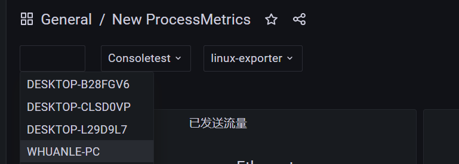


### 安装 ProcsssMetrics

只需要通过 Nuget 安装一个库，即可快速为程序添加资源监视，接着可将监控数据收集起来，让 Prometheus 被动捕获或主动推送。

支持三种启动方式。


#### 监控 URL

有两种方式使用 Metrics，第一种是使用内置的 HttpListener，不需要放到 Web 中即可独立提供 URL 访问，适合 winform、wpf 或纯 控制台等应用。但是使用 HttpListener，需要使用管理员方式启动应用才能正常运行。

使用方法：

```csharp
using CZGL.ProcessMetrics;
... ...
MetricsServer metricsServer = new MetricsServer("http://*:1234/metrics/");
metricsServer.Start();
```

> 此方式需要暴露端口和 URL ，由 Prometheus 捕获。


#### ASP.NET Core

另外一种是使用 ASP.NET Core，Metrics 作为中间件加入到 Web 应用中，此时使用的是 kestrel 。

在 Nuget 中，搜索 `CZGL.ProcessMetrics.ASPNETCore` 包，然后使用中间件生成 Metrics 端点。

```csharp
            app.UseEndpoints(endpoints =>
            {
                endpoints.MapControllers();
                endpoints.ProcessMetrices("/metrics");
            });
```


访问相应的 URL，可以看到有很多信息输出，这些都是 Prometheus 数据的格式。

```
http://127.0.0.1:1234/metrics
```

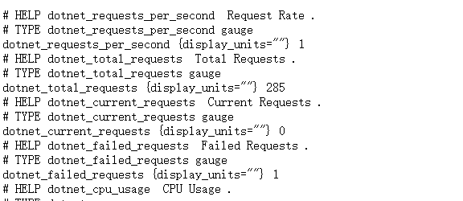


#### 主动推送

主动推送方式，可以不需要绑定端口，也不需要暴露 URL，Wpf、Winfrom 应用可以更加方便地推送数据，也可以将外网内网隔离开来。

部署 Pushgateway：

```shell
docker run -d \
  --name=pg \
  -p 9091:9091 \
  prom/pushgateway
```

> 端口是 9091；也可以使用别的方式部署。


然后在 Prometheus 的 prometheus.yml 文件最后加上：

```shell
  - job_name: 'linux-pushgateway'
    metrics_path: /metrics
    static_configs:
    - targets: ['172.16.2.101:9091']
```


推送监控信息：

```csharp
MetricsPush metricsPush = new MetricsPush("http://127.0.0.1:9091");
var result = await metricsPush.PushAsync();
```


### 自定义 EventSource

在 .NET 中，内置了以下 EventSource：

```
             * Microsoft-Windows-DotNETRuntime
             * System.Runtime
             * Microsoft-System-Net-Http
             * System.Diagnostics.Eventing.FrameworkEventSource
             * Microsoft-Diagnostics-DiagnosticSource
             * Microsoft-System-Net-Sockets
             * Microsoft-System-Net-NameResolution
             * System.Threading.Tasks.TplEventSource
             * System.Buffers.ArrayPoolEventSource
             * Microsoft-System-Net-Security
             * System.Collections.Concurrent.ConcurrentCollectionsEventSource
```


这些 Eventsource 是实现 Metrics、Log、Tracing 的绝佳数据来源，例如在 System.Runtime 中，可以获得以下信息：

```
[System.Runtime]
    % Time in GC since last GC (%)                         0
    Allocation Rate / 1 sec (B)                            0
    CPU Usage (%)                                          0
    Exception Count / 1 sec                                0
    GC Heap Size (MB)                                      4
    Gen 0 GC Count / 60 sec                                0
    Gen 0 Size (B)                                         0
    Gen 1 GC Count / 60 sec                                0
    Gen 1 Size (B)                                         0
    Gen 2 GC Count / 60 sec                                0
    Gen 2 Size (B)                                         0
    LOH Size (B)                                           0
    Monitor Lock Contention Count / 1 sec                  0
    Number of Active Timers                                1
    Number of Assemblies Loaded                          140
    ThreadPool Completed Work Item Count / 1 sec           3
    ThreadPool Queue Length                                0
    ThreadPool Thread Count                                7
    Working Set (MB)                                      63
```


在 CZGL.ProcessMetrics 中，默认只监控了 System.Runtime，如果需要捕获其它 EventSource，则可以通过配置添加：

```csharp
            app.UseEndpoints(endpoints =>
            {
                endpoints.MapControllers();
                endpoints.ProcessMetrices("/metrics", options =>
                {
                    // 监控 CLR 中的事件
                    options.ListenerNames.Add(EventNames.System_Runtime);
                    // 监控 ASP.NET Core 中的请求
                    options.ListenerNames.Add(EventNames.AspNetCore_Http_Connections);
                    
                    options.ListenerNames.Add("自定义的EventSource名称");
                    
                    // 无特殊需求，请不要使用
                    // options.Labels.Add("other", "自定义标识");

                    // 自定义要监控的数据源，可以自由使用
                    // options.Assemblies.Add(..);
                });
            });
```

另外，你也可以自行添加 EventSource，这些 EventSource 可以使用 dotnet-counter、dotnet-dump 等工具捕获。

你可以参考这里，编写 EventSource：[https://github.com/microsoft/dotnet-samples/blob/master/Microsoft.Diagnostics.Tracing/EventSource/docs/EventSource.md](https://github.com/microsoft/dotnet-samples/blob/master/Microsoft.Diagnostics.Tracing/EventSource/docs/EventSource.md)


### 自定义监控数据

在 CZGL.ProcessMetrics 中，内置了一些数据源，这些数据可能来自机器、可能来自应用，但是不一定符合你的需求，你可以自定义添加一些需要的数据指标，例如 wpf 的鼠标点击次数等。

只需要继承 `IMerticsSource` 接口即可。

示例如下：

```csharp
    public class CLRMetrics : IMerticsSource
    {
        public async Task InvokeAsync(ProcessMetricsCore metricsCore)
        {
            await Task.Factory.StartNew(() =>
            {
                Gauge monitor = metricsCore.CreateGauge("dotnet_lock_contention_total", "Provides a mechanism that synchronizes access to objects.");
                monitor.Create()
                    .AddLabel("process_name","myapp")
                    .SetValue(Monitor.LockContentionCount);
            });
        }
    }
```


然后添加需要自定义数据源的程序集，在程序启动时，会主动扫描。

```csharp
endpoints.ProcessMetrices("/metrics", options =>
{
// 监控 CLR 中的事件
options.ListenerNames.Add(EventNames.System_Runtime);
options.Labels.Add("other", "自定义标识");

 // 自定义要监控的数据源
options.Assemblies.Add(typeof(CZGL.ProcessMetrics.MetricsPush).Assembly);
});
```


### 搭建 Prometheus/Grafana

这里我们使用 Docker 来搭建监控平台。

拉取镜像：

```shell
docker pull prom/prometheus
docker pull grafana/grafana 
```

在 `/opt/prometheus` 目录下，新建一个 `prometheus.yml` 文件，其内容如下：

```yaml
# my global config
global:
  scrape_interval:     15s # Set the scrape interval to every 15 seconds. Default is every 1 minute.
  evaluation_interval: 15s # Evaluate rules every 15 seconds. The default is every 1 minute.
  # scrape_timeout is set to the global default (10s).

# Alertmanager configuration
alerting:
  alertmanagers:
  - static_configs:
    - targets:
      # - alertmanager:9093

# Load rules once and periodically evaluate them according to the global 'evaluation_interval'.
rule_files:
  # - "first_rules.yml"
  # - "second_rules.yml"

# A scrape configuration containing exactly one endpoint to scrape:
# Here it's Prometheus itself.
scrape_configs:
  # The job name is added as a label `job=<job_name>` to any timeseries scraped from this config.
  - job_name: 'prometheus'

    # metrics_path defaults to '/metrics'
    # scheme defaults to 'http'.

    static_configs:
    - targets: ['localhost:9090']


  - job_name: 'processmetrice'
    metrics_path: '/metrics'
    static_configs:
    - targets: ['123.123.123.123:1234']
```

> 请替换最后一行的 IP。


使用容器启动 Prometheus：

```shell
docker run  -d   -p 9090:9090   -v /opt/prometheus/prometheus.yml:/etc/prometheus/prometheus.yml    prom/prometheus
```

使用容器启动 Grafana：

```shell
mkdir /opt/grafana-storage
chmod 777 -R /opt/grafana-storage
docker run -d   -p 3000:3000   --name=grafana   -v /opt/grafana-storage:/var/lib/grafana   grafana/grafana
```


打开 9090 端口，在菜单栏中打开 `Status-Targets`，可以看到有相关记录。

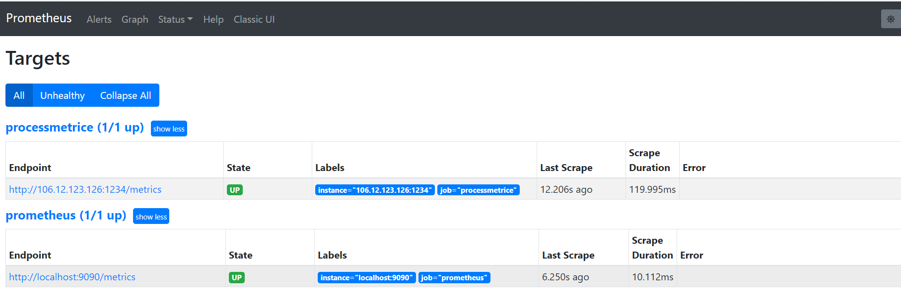

接着，访问 3000 端口，打开 Grafana，初始账号密码都是 admin 。


### 配置 Grafana

首先我们要为 Grafana 获取 Prometheus 中的监控数据，我们要添加一个数据源。

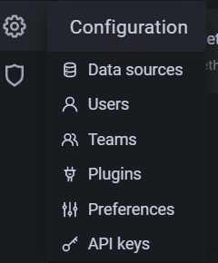

选择 Prometheus，按照提示，填写好 `HTTP-URL` 即可。

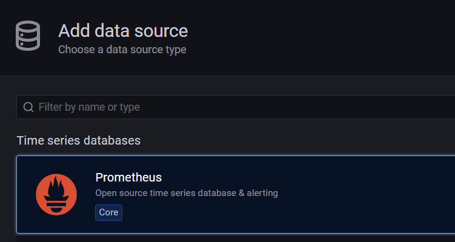


接着，下载笔者定制好的 Jsom Model，文件名为 `CZGL.ProcessMetrics.json`。

下载地址：
[https://github.com/whuanle/CZGL.SystemInfo/releases/tag/v1.0](https://github.com/whuanle/CZGL.SystemInfo/releases/tag/v1.0)

然后导入模型文件。


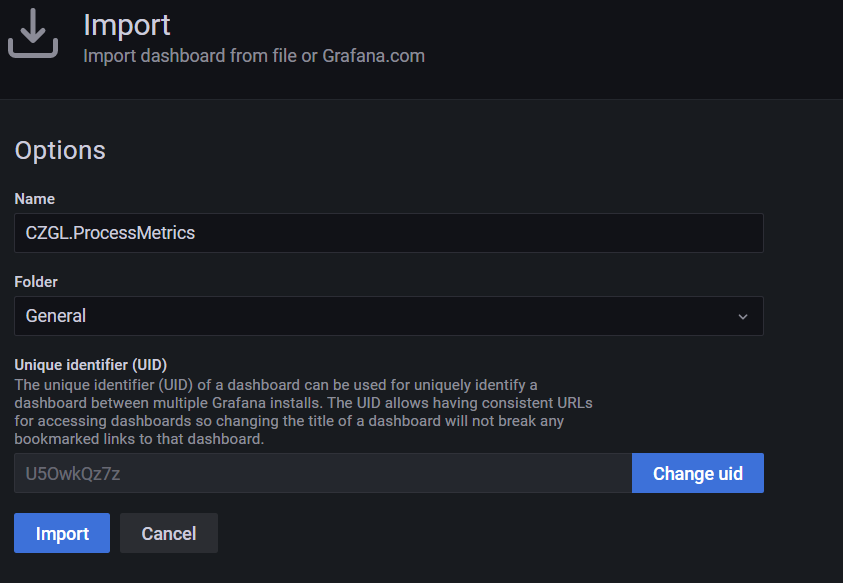


即可看到监控界面。

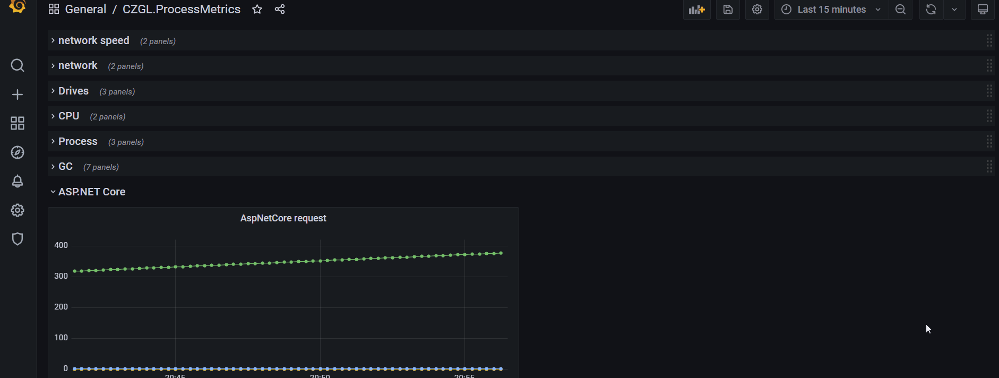


### dotnet tool 体验

目前做了个简单的 dotnet 工具，无需 SDK，runtime 下即可使用。

安装命令：

```shell
dotnet tool install --global csys
# or
dotnet tool install --global csys --version 1.0.3
```

```
You can invoke the tool using the following command: csys
Tool 'csys' (version '1.0.2') was successfully installed.
```

如果在 Linux 下，安装，还需要设置环境变量：

```
export PATH="$PATH:/home/{你的用户名}/.dotnet/tools"
```


安装完毕后，输入命令进入小工具：

```shell
csys
```

```csharp
请输入命令
+-------命令参考------------------------------+
| 1. 输入 netinfo 查看网络详情                  |
| 2. 输入 nett 监控网络流量                     |
| 3. 输入 test ，检查当前操作系统不兼容哪些 API    |
| 4. 输入 ps 查看进程信息                       |
+---------------------------------------------+
```

注：需要使用超级管理员启动程序，才能使用 ps 功能；

动图：


小工具功能不多，有兴趣可以下载 Nuget 包，里面有更多功能。


### CZGL.SystemInfo

CZGL.SystemInfo 目前有四个类：DiskInfo、NetworkInfo、ProcessInfo、SystemPlatformInfo，下面一一介绍。

为了避免资源浪费，DiskInfo、NetworkInfo、ProcessInfo 部分属性使用懒加载，不使用此 API 的情况下，不需要消耗性能。

```csharp
Install-Package CZGL.SystemInfo -Version 1.0.1
```


#### SystemPlatformInfo

静态类，能够获取运行环境信息和有限的硬件信息，所有信息在程序启动前就已经确定。

其 API 说明及获得的数据示例如下：

| 属性                 | 说明                            | Windows 示例                    | Linux 示例                                                   |
| -------------------- | ------------------------------- | ------------------------------- | ------------------------------------------------------------ |
| FrameworkDescription | 框架平台(.NET Core、Mono等)信息 | .NET Core 3.1.9                 | .NET Core 3.1.9                                              |
| FrameworkVersion     | 运行时信息版本                  | 3.1.9                           | 3.1.9                                                        |
| OSArchitecture       | 操作系统平台架构                | X64                             | X64                                                          |
| OSPlatformID         | 获取操作系统的类型              | Win32NT                         | Unix                                                         |
| OSVersion            | 操作系统内核版本                | Microsoft Windows NT 6.2.9200.0 | Unix 4.4.0.19041                                             |
| OSDescription        | 操作系统的版本描述              | Microsoft Windows 10.0.19041    | Linux 4.4.0-19041-Microsoft #488-Microsoft Mon Sep 01 13:43:00 PST 2020 |
| ProcessArchitecture  | 本进程的架构                    | X64                             | X64                                                          |
| ProcessorCount       | 当前计算机上的处理器数          | 8                               | 8                                                            |
| MachineName          | 计算机名称                      | dell-PC                         | dell-PC                                                      |
| UserName             | 当前登录到此系统的用户名称      | dell                            | dell                                                         |
| UserDomainName       | 用户网络域名称                  | dell-PC                         | dell-PC                                                      |
| IsUserInteractive    | 是否在交互模式中运行            | True                            | True                                                         |
| GetLogicalDrives     | 系统的磁盘和分区列表            | C:\,D:\, E:\, F:\, G:\          | /, /dev, /sys, /proc, /dev/pts, /run, /run/shm               |
| SystemDirectory      | 系统根目录完全路径              | X:\WINDOWS\system32             |                                                              |
| MemoryPageSize       | 操作系统内存页一页的字节数      | 4096                            | 4096                                                         |

SystemPlatformInfo 的 API 不会有跨平台不兼容问题，可以大胆使用。

效果演示：

```csharp
系统平台信息：

运行框架    :    .NET Core 3.1.0
操作系统    :    Microsoft Windows 10.0.17763
操作系统版本    :    Microsoft Windows NT 6.2.9200.0
平台架构    :    X64
机器名称    :    aaaa-PC
当前关联用户名    :    aaa
用户网络域名    :    aaa-PC
系统已运行时间(毫秒)    :    3227500
Web程序核心框架版本    :    3.1.0
是否在交互模式中运行    :    True
分区磁盘    :    C:\,D:\, E:\, F:\, G:\, H:\ 
系统目录    :    C:\windows\system32
... ...
```


#### CPU

获取 CPU 消耗时间、获取 CPU 使用率。

总的来说，计算的 CPU 使用率会比任务管理器低一些。

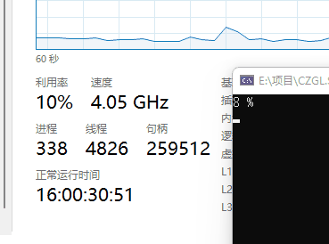

示例代码：

```csharp
    public static void Main(string[] args)
    {
        CPUTime v1 = CPUHelper.GetCPUTime();

        while (true)
        {
            Thread.Sleep(1000);
            var v2 = CPUHelper.GetCPUTime();
            var value = CPUHelper.CalculateCPULoad(v1, v2);
            v1 = v2;
            Console.Clear();
            Console.WriteLine($"{(int)(value * 100)} %");
        }
    }
```

有针对每个平台的封装。

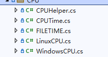


#### 内存监控

内存部分去掉了大量没用的 API，只保留跟获取系统内存相关的方法。


使用方法：

```csharp
            var memory = MemoryHelper.GetMemoryValue();
            Console.WriteLine($"已用内存：{memory.UsedPercentage * 100}%");
```

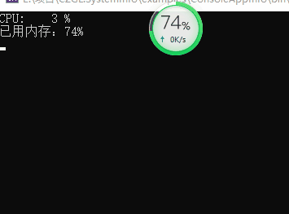


```csharp
    /// <summary>
    /// 内存值表示
    /// </summary>
    public struct MemoryValue
    {
        /// <summary>
        /// 物理内存字节数
        /// </summary>
        public ulong TotalPhysicalMemory { get; private set; }

        /// <summary>
        /// 可用的物理内存字节数
        /// </summary>
        public ulong AvailablePhysicalMemory { get; private set; }

        /// <summary>
        /// 已用物理内存字节数
        /// </summary>
        public ulong UsedPhysicalMemory => TotalPhysicalMemory - AvailablePhysicalMemory;

        /// <summary>
        /// 已用物理内存百分比，0~100，100表示内存已用尽
        /// </summary>
        public double UsedPercentage { get; private set; }

        /// <summary>
        /// 虚拟内存字节数
        /// </summary>
        public ulong TotalVirtualMemory { get; private set; }

        /// <summary>
        /// 可用虚拟内存字节数
        /// </summary>
        public ulong AvailableVirtualMemory { get; private set; }

        /// <summary>
        /// 已用虚拟内存字节数
        /// </summary>
        public ulong UsedVirtualMemory => TotalVirtualMemory - AvailableVirtualMemory;
    }
```


#### NetworkInfo

NetworkInfo 能够获取网络接口信息。

获取当前真实 IP：

```csharp
            var realIp = NetworkInfo.TryGetRealIpv4();
            if (realIp == null)
            {
                Console.WriteLine("未能获取网卡，操作终止");
                return;
            }
```

示例：`192.168.3.38`。


获取当前用于上网的网卡：

```csharp
var network = NetworkInfo.TryGetRealNetworkInfo();
```


如使用 wifi，获取到的就是无线网卡；使用网线上网，获取到的是以太网卡。

API 使用示例：

```csharp
            var info = NetworkInfo.GetNetworkInfo();
            Console.WriteLine("\r\n+++++++++++");
            Console.WriteLine($"    网卡名称    {info.Name}");
            Console.WriteLine($"    网络链接速度 {info.Speed / 1000 / 1000} Mbps");
            Console.WriteLine($"    Ipv6       {info.AddressIpv6.ToString()}");
            Console.WriteLine($"    Ipv4       {info.AddressIpv4.ToString()}");
            Console.WriteLine($"    DNS        {string.Join(',', info.DNSAddresses.Select(x => x.ToString()).ToArray())}");
            Console.WriteLine($"    上行流量统计 {info.SendLength / 1024 / 1024} MB");
            Console.WriteLine($"    下行流量统计 {info.ReceivedLength / 1024 / 1024} MB");
            Console.WriteLine($"    网络类型     {info.NetworkType}");
            Console.WriteLine($"    网卡MAC     {info.Mac}");
            Console.WriteLine($"    网卡信息     {info.Trademark}");
```


Status 属性可以获取此网卡的状态，其枚举说明如下：

| Dormant        | 5    | 网络接口不处于传输数据包的状态；它正等待外部事件。           |
| -------------- | ---- | ------------------------------------------------------------ |
| Down           | 2    | 网络接口无法传输数据包。                                     |
| LowerLayerDown | 7    | 网络接口无法传输数据包，因为它运行在一个或多个其他接口之上，而这些“低层”接口中至少有一个已关闭。 |
| NotPresent     | 6    | 由于缺少组件（通常为硬件组件），网络接口无法传输数据包。     |
| Testing        | 3    | 网络接口正在运行测试。                                       |
| Unknown        | 4    | 网络接口的状态未知。                                         |
| Up             | 1    | 网络接口已运行，可以传输数据包。                             |


NetworkType 可以获得网卡接口类型，其枚举比较多，详细请参考：

https://docs.microsoft.com/zh-cn/dotnet/api/system.net.networkinformation.networkinterfacetype?view=netcore-3.1

通常，监控网络，一时检查网络是否畅通，二是监控流量。

`NetworkInfo.IsAvailable` 静态属性可以检查当前机器是否能够连接互联网。符合条件的网卡必须是能够运行可以传输数据包，并且不能是本地回环地址。如果你是内网，则可能不需要此API，可以自己 ping 内网其它机器，确保网络畅通。


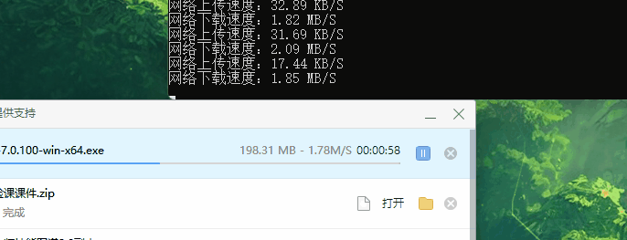


实时监控网络速度的使用方法：

```csharp
    public static void Main(string[] args)
    {
        CPUTime v1 = CPUHelper.GetCPUTime();
        var network = NetworkInfo.TryGetRealNetworkInfo();
        var oldRate = network.GetIpv4Speed();
        while (true)
        {
            Thread.Sleep(1000);
            var v2 = CPUHelper.GetCPUTime();
            var value = CPUHelper.CalculateCPULoad(v1, v2);
            v1 = v2;

            var memory = MemoryHelper.GetMemoryValue();
            var newRate = network.GetIpv4Speed();
            var speed = NetworkInfo.GetSpeed(oldRate, newRate);
            oldRate = newRate;
            Console.Clear();
            Console.WriteLine($"CPU:    {(int)(value * 100)} %");
            Console.WriteLine($"已用内存：{memory.UsedPercentage}%");
            Console.WriteLine($"上传：{speed.Sent.Size} {speed.Sent.SizeType}/S    下载：{speed.Received.Size} {speed.Received.SizeType}/S");
        }
    }

```

`(int Received, int Send) GetInternetSpeed(int Milliseconds)` 方法可以监控某个的网络传输数据量，时间一般时间设置为 1000 ms。

```
Received 是下载的流量
Sent     是上传的流量
```


一般来说，电脑只有一个网卡在连接互联网进行工作，所以可以使用：


会自动找到电脑正在用来访问互联网的网卡，并记录流量大小。


还有个 `Speed` 属性，可以查询到网卡最大支持速率。

如果是-1，则说明无法获取此网卡的链接速度；例如 270_000_000 表示是 270MB(一般指 300M 网卡) 的链接速度。千兆网卡是 1000_000_000(1000M)。

其它 API 就不介绍了。

直接反射查看：

```csharp
NetworkInterface System.Net.NetworkInformation.SystemNetworkInterface
Id {43538D18-BB0E-4CE2-8F66-613FAC9467BD}
Mac E09D3116D014
Name WLAN
Trademark Intel(R) Centrino(R) Advanced-N 6205
PhysicalMac E09D3116D014
Status Up
NetworkType Wireless80211
Statistics System.Net.NetworkInformation.SystemIPInterfaceStatistics
Ipv4Statistics System.Net.NetworkInformation.SystemIPv4InterfaceStatistics
ReceivedLength 103449771
ReceivedLengthIpv4 103449771
SendLength 23753785
SendLengthIpv4 23753785
IsAvailable True
Speed 300000000
IsSupportIpv4 True
IsSupportIpv6 True
DnsSuffix
DNSAddresses System.Net.NetworkInformation.InternalIPAddressCollection
UnicastIPAddressInformationCollection System.Net.NetworkInformation.UnicastIPAddressInformationCollection
AddressIpv6 fe90::adbb:6aa1:2b1f:ae9b%11
AddressIpv4 192.168.3.3
GetPhysicalMac E69D3116D514
```


注意，因为有些 API ，Linux 下环境差异比较大，建议使用使用 csys 小工具的 test 命令，检查有哪些 API 可以在此 Linux 环境中使用。


#### DiskInfo

DiskInfo 能够获取的信息不多。

可以使用静态方法获取所有磁盘的 DiskInfo 对象：

```
DiskInfo.GetDisks()
```

```csharp
DriveInfo F:\
Id F:\
Name F:\
DriveType Fixed
FileSystem NTFS
FreeSpace 76498378752
TotalSize 112718770176
UsedSize 36220391424
```

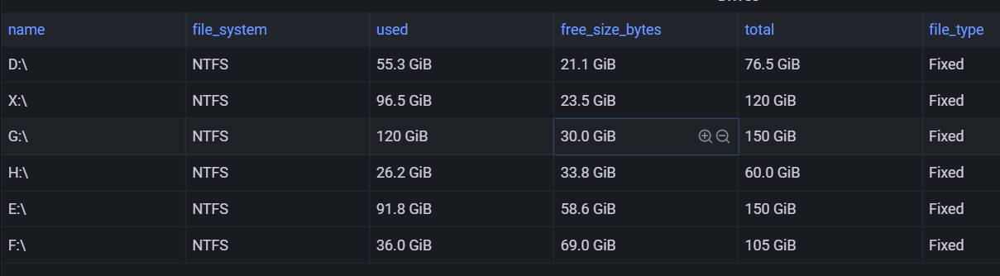


### Linux

Nuget 搜索 `CZGL.SystemInfo.Linux` 安装。

在这个库中，Linux 资源信息包括 进程计量，内存计量，CPU计量，虚拟内存计量，各种进程运行信息计量。


要通过实例化 `DynamicInfo` 才能获取。

有 5 个对象用于映射相应信息。

Tasks：用于统计进程数量，处于不同状态下的进程数。

CpuState：CPU 使用情况，CPU 各种负载信息。

Mem：物理内存和缓存使用情况。

Swap：虚拟内存使用情况。

PidInfo：一个进程的运行资源信息。

他们都有一个 IsSuccess 属性，用来判断是否能正常获取到 Linux 的信息。

实例化获取对象

```c#
            DynamicInfo info = new DynamicInfo();
```


#### 直接使用

可以通过方法获取到相应的对象。

```c#
            var item = info.GetTasks();
            Console.WriteLine("系统中共有进程数    :" + item.Total);
            Console.WriteLine("正在运行的进程数    :" + item.Running);
```

```c#
            Console.WriteLine("  进程Id  进程名称  所属用户    优化级  高低优先级  虚拟内存   物理内存   共享内存 进程状态  占用系统CPU(%)   占用内存(%d) ");
```

输出

```shell
进程统计：
Total    :    93
Running    :    1
Sleeping    :    59
Stopped    :    0
Zombie    :    0


CPU资源统计：
UserSpace    :    1
Sysctl    :    0.6
NI    :    0
Idolt    :    98.3
WaitIO    :    0.1
HardwareIRQ    :    0
SoftwareInterrupts    :    0

内存统计：
Total    :    1009048
Used    :    334040
Free    :    85408
Buffers    :    589600
CanUsed    :    675008


获取虚拟内存统计：
Total    :    0
Used    :    0
Free    :    0
AvailMem    :    505744

```
