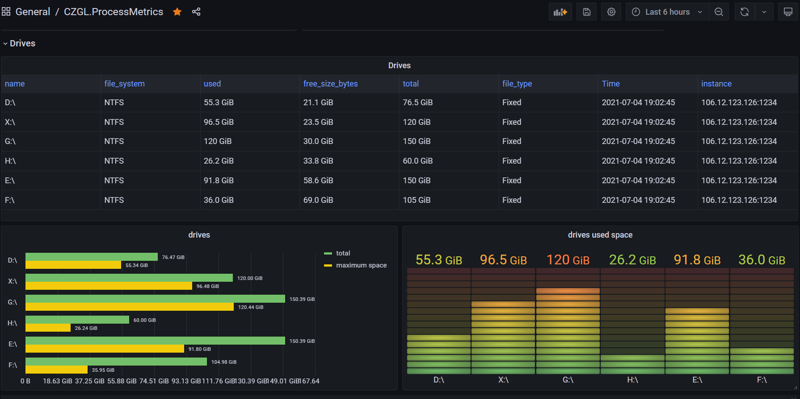
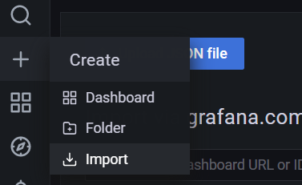

### 导读

CZGL.ProcessMetrics 是一个 Metrics 库，能够将程序的 GC、CPU、内存、机器网络、磁盘空间等信息记录下来，使用 Prometheus 采集信息，然后使用 Grafana 显示。

视频地址：

[https://www.bilibili.com/video/BV18y4y1K7Ax/](https://www.bilibili.com/video/BV18y4y1K7Ax/)

教程地址：[https://github.com/whuanle/CZGL.SystemInfo/blob/primary/docs/Metrics.md](https://github.com/whuanle/CZGL.SystemInfo/blob/primary/docs/Metrics.md)

效果图预览：




### 安装 ProcsssMetrics

只需要通过 Nuget 安装一个库，即可快速为程序添加资源监视。

新建一个 ASP.NET Core 应用， Nuget 中搜索 `CZGL.ProcessMetrics` 直接引用即可。

Nuget 地址：[https://www.nuget.org/packages/CZGL.ProcessMetrics](https://www.nuget.org/packages/CZGL.ProcessMetrics)

然后在中间件中，加上 `ProcessMetrics` 的访问服务。

```csharp
            app.UseEndpoints(endpoints =>
            {
                endpoints.MapControllers();
                endpoints.ProcessMetrices("/metrics");
            });
```

访问相应的 URL，可以看到有很多信息输出，这些都是 Prometheus 数据的格式。

```
http://127.0.0.1:1234/metrics
```


### 搭建 Prometheus/Grafana

这里我们使用 Docker 来搭建监控平台。

拉取镜像：

```shell
docker pull prom/prometheus
docker pull grafana/grafana 
```

在 `/opt/prometheus` 目录下，新建一个 `prometheus.yml` 文件，其内容如下：

```yaml
# my global config
global:
  scrape_interval:     15s # Set the scrape interval to every 15 seconds. Default is every 1 minute.
  evaluation_interval: 15s # Evaluate rules every 15 seconds. The default is every 1 minute.
  # scrape_timeout is set to the global default (10s).

# Alertmanager configuration
alerting:
  alertmanagers:
  - static_configs:
    - targets:
      # - alertmanager:9093

# Load rules once and periodically evaluate them according to the global 'evaluation_interval'.
rule_files:
  # - "first_rules.yml"
  # - "second_rules.yml"

# A scrape configuration containing exactly one endpoint to scrape:
# Here it's Prometheus itself.
scrape_configs:
  # The job name is added as a label `job=<job_name>` to any timeseries scraped from this config.
  - job_name: 'prometheus'

    # metrics_path defaults to '/metrics'
    # scheme defaults to 'http'.

    static_configs:
    - targets: ['localhost:9090']


  - job_name: 'processmetrice'
    metrics_path: '/metrics'
    static_configs:
    - targets: ['123.123.123.123:1234']
```

> 请替换最后一行的 IP。


使用容器启动 Prometheus：

```shell
docker run  -d   -p 9090:9090   -v /opt/prometheus/prometheus.yml:/etc/prometheus/prometheus.yml    prom/prometheus
```
使用容器启动 Grafana：
```shell
mkdir /opt/grafana-storage
chmod 777 -R /opt/grafana-storage
docker run -d   -p 3000:3000   --name=grafana   -v /opt/grafana-storage:/var/lib/grafana   grafana/grafana
```


打开 9090 端口，在菜单栏中打开 `Status-Targets`，可以看到有相关记录。


接着，访问 3000 端口，打开 Grafana，初始账号密码都是 admin 。


### 配置 Grafana

首先我们要为 Grafana 获取 Prometheus 中的监控数据，我们要添加一个数据源。


选择 Prometheus，按照提示，填写好 `HTTP-URL` 即可。


接着，下载笔者定制好的 Jsom Model，文件名为 `CZGL.ProcessMetrics.json`。

下载地址：
[https://github.com/whuanle/CZGL.SystemInfo/releases/tag/v1.0](https://github.com/whuanle/CZGL.SystemInfo/releases/tag/v1.0)

然后导入模型文件。




即可看到监控界面。

